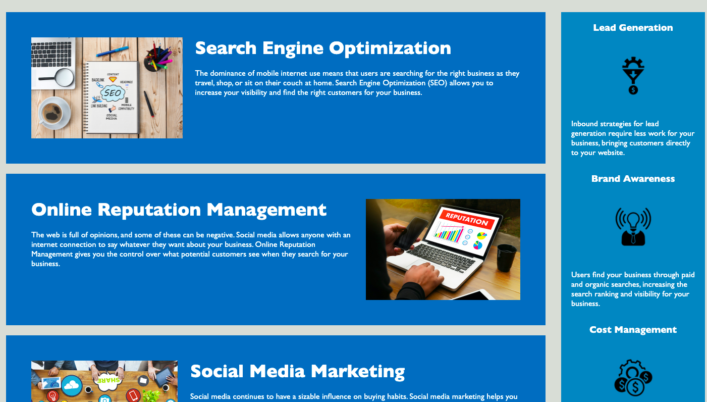
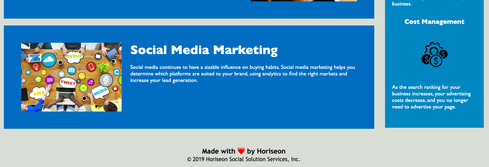

# Fun Seo Refactor | 1: Code Refactor Homework

## Table of Contents
1. [Description](#description)
2. [Visuals](#visuals)
3. [Deployment](#deployment)

## Description

Researched different semantic tags wtihin HTML and what their various uses are. Then refactored the code we were given by replacing non-semantic tags wtih semantic ones while also cleaning up the CSS stylesheet.

## Visuals

Here are 3 simple screenshots of the webpage:

 

## Deployment

[Link to live site](https://slwooten.github.io/fun-seo-refactor/) 